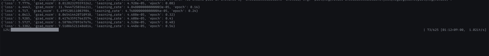
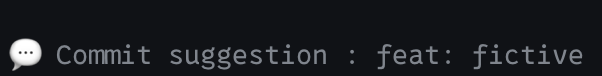

## Easy commit

Create a model with Deep Learning (supervised) by training it on the repository of your choice (which you'll have locally), giving it the changes as input and the commit message as output.

This allows you to have a model trained with its own context, so it will respect the commit message conventions of the repository with which it has been trained.

### Install dependencies

```bash
source venv/bin/activate
pip install -r requirements.txt
```

### Train the model

```bash
python main.py
>> Do you want to generate a commit message or to train the model on a specific repository ?:
[train/generate] : train
>> Enter the path to the repository you want to train on:
/path/to/your/repo
```
And it will start training the model on the repository you provided. It will take a while depending on the size of the repository and the number of commits it has.

### Generate a commit message

```bash
python main.py
>> Do you want to generate a commit message or to train the model on a specific repository ?:
[train/generate] : generate
>> Enter the path to the repository you want to generate a commit message for:
/path/to/your/repo
```
And it will generate a commit message for the repository you provided based on the staged changes.

## Results example

Trained on the https://my.optifit.app repository's main branch (approximately 600 commits).

Look at this little boy training on the repository:



These changes were made to the repository: (just added `fictive` property to an object)

```diff
│     const phasesMatches: MatchWithLocationDetails[] = [];
│-    const phases: { id: string; type: TournamentPhase['type'] }[] = [];
│+    const phases: {
│+      id: string;
│+      type: TournamentPhase['type'];
│+      fictive: boolean;
│+    }[] = [];
│
│     tournament.phases?.forEach((phase) => {
│       const phaseId = uuidv4();
│@@ -63,6 +67,7 @@ export class GetRankingService {
│       phases.push({
│         id: phaseId,
│         type: phase.type,
│+        fictive: phase.fictive,
│       });
│     });
│
│diff --git a/backend/src/types/tournament.d.ts b/backend/src/types/tournament.d.ts
│index f66422c..4c15fb4 100644
│--- a/backend/src/types/tournament.d.ts
│+++ b/backend/src/types/tournament.d.ts
│@@ -227,6 +227,8 @@ export interface Ranking {
│   }[];
│   phases?: {
│     type: TournamentPhase['type'];
│+    id?: string;
│+    fictive?: boolean;
│   }[];
│   matches?: MatchWithLocationDetails[];
│ }
│diff --git a/webapp/src/types/tournament.d.ts b/webapp/src/types/tournament.d.ts
│index f2a5b93..4a390ad 100644
│--- a/webapp/src/types/tournament.d.ts
│+++ b/webapp/src/types/tournament.d.ts
│@@ -160,6 +160,7 @@ export interface Ranking {
│   phases?: {
│     type: TournamentPhase['type'];
│     id: string;
│+    fictive?: boolean;
│   }[];
│ }
│
```
The model generated the following commit message:



